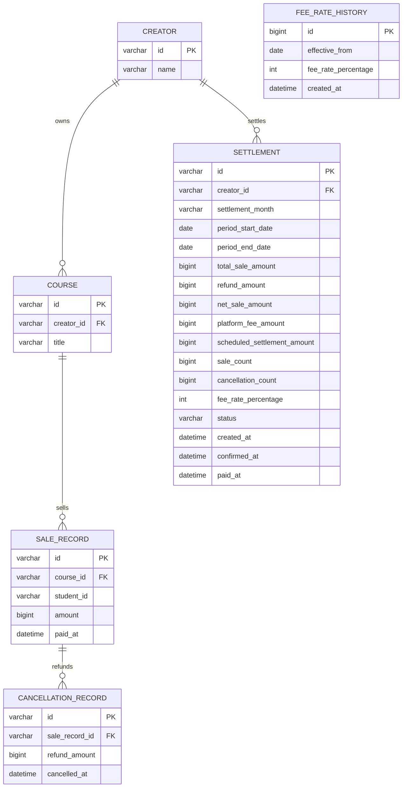

# Database Design

## 1. 설계 목표
이 프로젝트 DB는 아래 4가지를 안정적으로 처리하도록 설계했다.

- 판매 이벤트 저장
- 취소/환불 이벤트 저장
- 월별 정산 계산
- 운영자용 기간 집계 및 감사 조회

핵심 원칙은 단순하다.

- 판매 월과 취소 월은 분리해서 본다.
- 정산 생성 전에는 조회 시점 계산값을 쓴다.
- 정산 생성 후에는 스냅샷을 `settlements`에 저장한다.
- 수수료율은 `fee_rate_histories` 이력 기준으로 적용한다.

## 2. 엔티티 / 테이블
- `creators`
- `courses`
- `sale_records`
- `cancellation_records`
- `settlements`
- `fee_rate_histories`

관계:
- `Creator 1:N Course`
- `Course 1:N SaleRecord`
- `SaleRecord 1:N CancellationRecord`
- `Creator 1:N Settlement`

## 3. ERD


## 4. 테이블 역할

### 4.1 creators
- 강사 마스터
- 컬럼: `id`, `name`

### 4.2 courses
- 강의 마스터
- 컬럼: `id`, `creator_id`, `title`

### 4.3 sale_records
- 결제 완료 판매 이벤트
- 컬럼: `id`, `course_id`, `student_id`, `amount`, `paid_at`

### 4.4 cancellation_records
- 취소/환불 이벤트
- 컬럼: `id`, `sale_record_id`, `refund_amount`, `cancelled_at`
- 같은 판매에 여러 건 연결 가능

### 4.5 settlements
- 월별 정산 스냅샷
- 컬럼:
  - `id`
  - `creator_id`
  - `settlement_month`
  - `period_start_date`, `period_end_date`
  - `total_sale_amount`, `refund_amount`, `net_sale_amount`
  - `platform_fee_amount`, `scheduled_settlement_amount`
  - `sale_count`, `cancellation_count`
  - `fee_rate_percentage`
  - `status`
  - `created_at`, `confirmed_at`, `paid_at`
- unique: `creator_id + settlement_month`

주의:
- 예전 문서의 `year_month`는 현재 코드 기준으로 `settlement_month`다.

### 4.6 fee_rate_histories
- 수수료율 이력
- 컬럼: `id`, `effective_from`, `fee_rate_percentage`, `created_at`
- unique: `effective_from`

## 5. 왜 판매와 취소를 분리했나
- 부분 취소 지원이 쉬움
- 여러 번 나눠 환불 가능
- 판매 월과 취소 월 분리 집계가 자연스러움
- 감사 로그 추적이 쉬움

한 테이블에 `cancelled`, `refund_amount`만 두면 월경계 취소와 다중 환불에서 금방 복잡해진다.

## 6. 정산 계산 규칙

### 월별 조회
1. `sale_records.paid_at` 기준으로 해당 월 판매 합산
2. `cancellation_records.cancelled_at` 기준으로 해당 월 환불 합산
3. `net_sale_amount = total_sale_amount - refund_amount`
4. 판매 수수료는 각 판매의 `paidAt` 기준 수수료율로 계산한다.
5. 환불 수수료 차감은 각 환불의 원판매 `paidAt` 기준 수수료율로 계산한다.
6. `platform_fee_amount = 판매 수수료 합 - 환불 수수료 합`
7. `scheduled_settlement_amount = net_sale_amount - platform_fee_amount`

현재 구현은 환불만 있는 월도 음수 정산값을 그대로 반환한다. 즉, `0원 처리`가 아니라 마이너스 이월형 해석에 가깝다.

### 상태 스냅샷
- 조회만 할 때: 실시간 계산
- `POST /api/settlements` 호출 후: 계산 결과를 `settlements`에 저장
- 상태 흐름: `PENDING -> CONFIRMED -> PAID`

## 7. Views / Functions

## 7.1 Functions

### `fn_net_sale_amount(total_sale_amount, refund_amount)`
- 역할: 순매출 계산
- 식: `ifnull(total_sale_amount, 0) - ifnull(refund_amount, 0)`

### `fn_platform_fee_amount(net_sale_amount, fee_rate_percentage)`
- 역할: 플랫폼 수수료 계산
- 식: `round(net_sale_amount * fee_rate_percentage / 100, 0)`

### `fn_scheduled_settlement_amount(total_sale_amount, refund_amount, fee_rate_percentage)`
- 역할: 정산 예정 금액 계산
- 내부적으로 앞 2개 함수를 조합한다.

## 7.2 Views

### `vw_sale_audit`
- 역할: 판매 1건 기준 감사/운영 뷰
- 포함 정보:
  - 강사 ID / 이름
  - 강의 ID / 제목
  - 학생 ID
  - 판매 금액 / 결제 시각
  - 누적 환불 금액
  - 잔여 금액
  - 취소 건수
  - 마지막 취소 시각
  - 판매 상태(`COMPLETED`, `PARTIALLY_REFUNDED`, `FULLY_REFUNDED`)
- 시각 컬럼은 저장된 UTC 값을 KST로 변환해서 노출한다.

### `vw_creator_monthly_settlement_base`
- 역할: 강사별 월별 집계 베이스 뷰
- 포함 정보:
  - 강사 ID / 이름
  - `settlement_month`
  - 판매 총액
  - 환불 총액
  - 순매출
  - 판매 건수
  - 취소 건수
- 판매 월 / 취소 월 계산은 UTC 저장값을 KST로 변환한 뒤 수행한다.

## 7.3 생성 위치
- 코드 파일: `src/main/java/io/github/jangws1030/creatorsettlementapi/db/DatabaseObjectInitializer.java`
- 생성 방식: `JdbcTemplate.execute(...)`
- 실행 시점: 애플리케이션 시작 시
- 실행 조건: MySQL 연결일 때만

## 7.4 로컬 MySQL 조건
MySQL binary logging이 켜진 환경에서는 함수 생성에 `log_bin_trust_function_creators=1`이 필요하다.

프로젝트 `docker-compose.yml`에 이미 넣어 둔 옵션:
```yaml
--log-bin-trust-function-creators=1
```

## 8. 샘플 데이터
기본 시드 기준:

- creators: `6`
- courses: `9`
- sale_records: `19`
- cancellation_records: `11`
- fee_rate_histories: `1`

### 강사/강의 매핑
| 강사 ID | 강사명 | 강의 |
|---|---|---|
| `creator-1` | `김강사` | `course-1 Spring Boot 입문`, `course-2 JPA 실전` |
| `creator-2` | `이강사` | `course-3 Kotlin 기초` |
| `creator-3` | `박강사` | `course-4 MSA 설계` |
| `creator-4` | `최강사` | `course-5 Querydsl 튜닝`, `course-6 Docker 배포 자동화` |
| `creator-5` | `정강사` | `course-7 Redis 실전` |
| `creator-6` | `한강사` | `course-8 관측성 입문`, `course-9 배치 처리 워크숍` |

## 9. 샘플 시나리오
- `creator-1 / 2025-03`: 기본 정산, 전액 취소, 부분 취소
- `creator-1 / 2025-04`: 다중 취소
- `creator-1 / 2025-05`: 월경계 직후 취소
- `creator-2 / 2025-01~02`: 판매 월 / 취소 월 분리
- `creator-2 / 2025-11`: HALF_UP 반올림
- `creator-2 / 2026-12`: 미래 월 조회
- `creator-3 / 2025-03`: 빈 월
- `creator-3 / 2025-04`: 결제와 같은 시각 취소
- `creator-4 / 2025-06`: 신규 강사 추가, 부분 취소
- `creator-5 / 2025-07~08`: 8월 1일 00:00:00 월경계 취소
- `creator-6 / 2025-08`: 부분 취소
- `creator-6 / 2025-10`: 부분 취소
- `TC-01`: 누적 부분 환불
- `TC-02`: 당월 순매출 음수
- `TC-03`: 지급 완료 후 취소
- `TC-04`: 수수료율 변경 소급 환불
- `TC-05`: 밀리초/초 단위 KST 경계

## 10. 인덱스 / 제약

제약:
- PK
- FK
- Not Null
- Unique(`settlements.creator_id + settlements.settlement_month`)
- Unique(`fee_rate_histories.effective_from`)

인덱스:
- `courses(creator_id)`
- `sale_records(course_id, paid_at)`
- `sale_records(paid_at)`
- `cancellation_records(sale_record_id, cancelled_at)`
- `cancellation_records(cancelled_at)`
- `settlements(creator_id, status)`
- `settlements(settlement_month)`

## 11. 현재 구현 기준 실제 생성 위치
- 샘플 데이터 시드: `SampleDataService`
- 정산 스냅샷: JPA 엔티티 `Settlement`
- DB functions / views: `DatabaseObjectInitializer`
